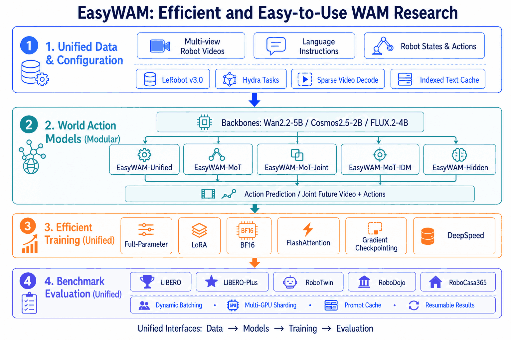
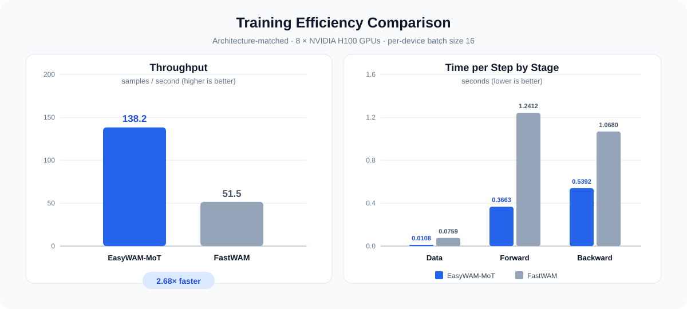

<p align="center">
  
</p>

<h1 align="center">🚀 EasyWAM: A Unified and Efficient Framework for Training and Evaluating World Action Models</h1>

<p align="center">A unified research codebase for training and evaluating World Action Models.</p>

<p align="center">
  <a href="./README.md"></a>
  <a href="./README_zh.md"></a>
  <a href="https://openmoss.github.io/EasyWAM/"></a>
  <a href="https://huggingface.co/collections/OpenMOSS-Team/easywam"></a>
  <a href="#-contact"></a>
</p>

**Start here:** [Quick start](#-quick-start) · [Supported models](#-supported-models-and-benchmarks) · [Benchmark results](#-benchmark-results) · [Checkpoints](https://huggingface.co/collections/OpenMOSS-Team/easywam) · [Documentation](#-documentation)

## ✨ Overview and Key Features

EasyWAM is a unified research codebase designed to make World Action Model development efficient, reproducible, and easy to extend. It connects model implementation, data processing, distributed training, parameter-efficient fine-tuning, and large-scale evaluation through a consistent workflow.

<p align="center">
  
</p>

- 🧩 **Unified and modular design.** Modular model components share consistent data, training, checkpoint, and evaluation interfaces, making new WAM designs easier to integrate.
- ⚡ **Efficient computation.** Efficiency is a first-class design goal in EasyWAM. It natively integrates **FlashAttention 2/3/4** to accelerate attention workloads and provides complete **LoRA** support from parameter-efficient training and checkpointing to merged inference. BF16, gradient checkpointing, DeepSpeed ZeRO, and PyTorch SDPA fallback further improve speed, memory usage, and compatibility.
- 🚄 **Optimized end-to-end pipeline.** EasyWAM streamlines every stage of training and inference. Sparse video decoding, indexed text caches, persistent workers, prompt caching, and resumable evaluation eliminate repeated work and deliver substantial speedups across both **training and inference**.
- 🛠️ **Easy-to-use workflows.** Hydra-based configuration, standardized training and evaluation recipes, distributed launchers, automatic GPU sharding, and result summaries keep common workflows straightforward.

> 🌟 **Hope:** We hope EasyWAM will become an efficient and easy-to-use codebase for World Action Model research, enabling researchers to explore WAMs more quickly and easily. More models and benchmarks will be continuously added and supported. We warmly welcome contributions from the community to help make EasyWAM better. If you encounter any problems or have suggestions for improving EasyWAM, please open an issue. We will continue to refine and improve EasyWAM.

## 📰 News

- **[2026-09-18]** EasyWAM adds RoboCasa365 and RoboDojo training and evaluation, updates RoboTwin for the current upstream with independent dynamic batch serving, and scales evaluation with multiple model workers per GPU and a GPU tuning tool. Training gains configurable checkpoint retention, state tokens after actions, and generic FLUX text embedding precomputation. This update also refreshes LIBERO and LIBERO-Plus results for Unified, MoT, and Hidden on Wan2.2 and Cosmos2.5, including Wan2.2 LoRA on LIBERO, with revised architecture analysis and evaluation defaults.
- **[2026-09-12]** EasyWAM introduces dynamic batched evaluation, requiring only a small number of workers while significantly reducing evaluation GPU memory usage and improving GPU utilization. This update also adds task/trial progress reporting, LeRobot v3 support, FlashAttention 2/3/4 with optimized text-padding mask semantics, configurable state-token placement and causal attention, execution and caching optimizations, automatic run logging, expanded documentation, and new benchmark results.
- **[2026-09-03]** EasyWAM adds FLUX.2/ImageWAM backbone integration.
- **[2026-09-02]** EasyWAM is released with unified training and evaluation workflows for World Action Models.

## 🤖 Supported Models and Benchmarks

### 🧠 Models

- **EasyWAM-Unified.** A single-backbone architecture that places video and action tokens in one Video DiT to jointly predict future video and actions. The architecture is based on [DreamZero](https://github.com/dreamzero0/dreamzero).
- **EasyWAM-MoT.** A dual-backbone model with separate Video DiT and Action DiT experts whose tokens interact through shared mixed self-attention. It performs action-only prediction and is based on [FastWAM](https://github.com/yuantianyuan01/FastWAM).
- **EasyWAM-MoT-Joint.** A dual-backbone model that jointly denoises video and action tokens through shared mixed self-attention.
- **EasyWAM-MoT-IDM.** A dual-backbone model that uses teacher-forced conditional video for action prediction.
- **EasyWAM-Hidden.** A dual-backbone architecture that uses intermediate Video DiT features as conditional input to a separate Action DiT. The architecture is based on [DiT4DiT](https://github.com/Mondo-Robotics/DiT4DiT).

| Model | Full-Parameter Training | LoRA Fine-Tuning |
| --- | :---: | :---: |
| EasyWAM-Unified | ✅ | ✅ |
| EasyWAM-MoT | ✅ | ✅ |
| EasyWAM-MoT-Joint | ✅ | ✅ |
| EasyWAM-MoT-IDM | ✅ | ✅ |
| EasyWAM-Hidden | ✅ | ✅ |

### 🏗️ Backbone

| Backbone | Supported |
| --- | :---: |
| Wan2.2-TI2V-5B | ✅ |
| Cosmos-Predict2.5-2B | ✅ |
| FLUX.2 Klein-4B | ✅ |

### 🧪 Benchmarks

| Benchmark | Supported | Training | Evaluation |
| --- | :---: | --- | --- |
| LIBERO | ✅ | Full-parameter and LoRA | Standard evaluation |
| LIBERO-Plus | ✅ | Uses LIBERO checkpoints | Robustness evaluation |
| RoboTwin | ✅ | Full-parameter and LoRA | Clean and randomized evaluation |
| RoboDojo | ✅ | Full-parameter and LoRA | Official 42-task simulation evaluation |
| RoboCasa365 | ✅ | Full-parameter and LoRA | Official 50-task evaluation |

## 🏆 Benchmark Results

> All results below are reported with `state_position: sequence`, where state/proprio tokens are placed after the action tokens in the model sequence.

<details open>
<summary><b>LIBERO</b></summary>

**Full-Parameter**

| Backbone | Model | Spatial | Object | Goal | Long | Avg. |
| --- | --- | :---: | :---: | :---: | :---: | :---: |
| Wan2.2-TI2V-5B | EasyWAM-Unified | 98.4 | 98.8 | 99.2 | 98.0 | 98.6 |
| Wan2.2-TI2V-5B | EasyWAM-MoT | 97.0 | 99.2 | 96.6 | 94.0 | 96.7 |
| Wan2.2-TI2V-5B | EasyWAM-MoT-Joint | 98.2 | 98.0 | 97.6 | 96.8 | 97.7 |
| Wan2.2-TI2V-5B | EasyWAM-MoT-IDM | 99.0 | 99.2 | 98.8 | 97.4 | 98.6 |
| Wan2.2-TI2V-5B | EasyWAM-Hidden | 99.2 | 100.0 | 97.8 | 98.2 | 98.8 |
| Cosmos-Predict2.5-2B | EasyWAM-Unified | 97.8 | 99.4 | 97.0 | 93.0 | 96.8 |
| Cosmos-Predict2.5-2B | EasyWAM-MoT | 98.0 | 98.4 | 98.4 | 95.6 | 97.6 |
| Cosmos-Predict2.5-2B | EasyWAM-MoT-Joint | 98.6 | 99.8 | 98.4 | 96.0 | 98.2 |
| Cosmos-Predict2.5-2B | EasyWAM-MoT-IDM | 99.4 | 99.4 | 99.8 | 98.4 | 99.3 |
| Cosmos-Predict2.5-2B | EasyWAM-Hidden | 97.2 | 98.8 | 96.0 | 95.0 | 96.8 |

**LoRA (Rank 128)**

| Backbone | Model | Spatial | Object | Goal | Long | Avg. |
| --- | --- | :---: | :---: | :---: | :---: | :---: |
| Wan2.2-TI2V-5B | EasyWAM-Unified | 91.2 | 98.8 | 91.8 | 66.2 | 87.0 |
| Wan2.2-TI2V-5B | EasyWAM-MoT | 96.8 | 99.6 | 97.4 | 90.0 | 95.9 |
| Wan2.2-TI2V-5B | EasyWAM-Hidden | 98.0 | 99.8 | 89.4 | 86.6 | 93.5 |

</details>

<details open>
<summary><b>LIBERO-Plus</b></summary>

| Backbone | Model | Background | Camera | Language | Layout | Light | Noise | Robot | Avg. |
| --- | --- | :---: | :---: | :---: | :---: | :---: | :---: | :---: | :---: |
| Wan2.2-TI2V-5B | EasyWAM-Unified | 72.3 | 54.8 | 93.7 | 83.4 | 97.0 | 72.0 | 83.4 | 79.0 |
| Wan2.2-TI2V-5B | EasyWAM-MoT | 64.5 | 45.5 | 71.4 | 80.1 | 94.7 | 78.5 | 71.5 | 71.7 |
| Wan2.2-TI2V-5B | EasyWAM-MoT-Joint | 60.9 | 47.3 | 89.7 | 80.5 | 92.4 | 68.9 | 75.9 | 73.3 |
| Wan2.2-TI2V-5B | EasyWAM-MoT-IDM | 62.2 | 52.0 | 94.1 | 82.0 | 93.2 | 67.8 | 78.0 | 75.3 |
| Wan2.2-TI2V-5B | EasyWAM-Hidden | 59.3 | 57.0 | 93.2 | 84.3 | 95.0 | 70.8 | 83.7 | 77.6 |
| Cosmos-Predict2.5-2B | EasyWAM-Unified | 72.7 | 63.7 | 90.1 | 82.6 | 89.2 | 72.1 | 79.2 | 78.2 |
| Cosmos-Predict2.5-2B | EasyWAM-MoT | 60.7 | 75.1 | 92.3 | 82.6 | 92.6 | 81.3 | 58.5 | 77.7 |
| Cosmos-Predict2.5-2B | EasyWAM-MoT-Joint | 62.1 | 60.8 | 96.6 | 84.5 | 94.4 | 69.4 | 76.9 | 77.7 |
| Cosmos-Predict2.5-2B | EasyWAM-MoT-IDM | 66.4 | 59.8 | 93.8 | 85.7 | 89.0 | 72.3 | 81.9 | 78.4 |
| Cosmos-Predict2.5-2B | EasyWAM-Hidden | 59.5 | 65.9 | 92.6 | 85.0 | 89.1 | 68.3 | 82.5 | 77.8 |

</details>

See the [complete benchmark results](docs/results/result.md) for more results and [What WAM Architecture Do We Need?](docs/blogs/blog01_arch.md) ([中文](docs/blogs/blog01_arch_zh.md)) for analysis.

## ⚡ Efficiency Results

> All efficiency results reported below use **Wan2.2-TI2V-5B** as the backbone. **Actual training time may vary with the CPU and GPU configuration; these figures are provided for reference only.** Please refer to the [efficiency configuration guide](docs/instructions/config/efficiency.md) to choose settings appropriate for your machine and improve training and inference efficiency.

EasyWAM-MoT and FastWAM use the same model architecture, enabling an architecture-matched comparison between the EasyWAM training framework and the original FastWAM codebase. Measured on **8 × NVIDIA H100 GPUs** with a **per-device batch size of 16**, EasyWAM-MoT achieves **138.2 samples/s**, a **2.68×** throughput improvement over FastWAM's 51.5 samples/s. It also reduces data, forward, and backward time per step by **85.8%**, **70.5%**, and **49.5%**, respectively.

<p align="center">
  
</p>

| Framework | Throughput (samples/s) ↑ | Data Time (s) ↓ | Forward Time (s) ↓ | Backward Time (s) ↓ |
| --- | :---: | :---: | :---: | :---: |
| EasyWAM-MoT | **138.2** | **0.0108** | **0.3663** | **0.5392** |
| FastWAM | 51.5 | 0.0759 | 1.2412 | 1.0680 |

On LIBERO, training for **20,000 steps** takes approximately **5 hours** with EasyWAM, compared with approximately **14 hours** using the original FastWAM codebase—a **64.3% reduction** in overall training time.

> 🌟 **Hope:** Training and evaluating World Action Models often requires substantial computational resources. EasyWAM aims to lower this barrier with an efficient and lightweight codebase, enabling researchers to train models, run evaluations, and iterate quickly even with limited compute. Through continuous efficiency improvements, we hope researchers can devote more of their resources to model and algorithm innovation and that more members of the community can participate in WAM research.

## 🚀 Quick Start

### 🛠️ Installation

```bash
conda create -n easywam python=3.10 -y
conda activate easywam
pip install -U pip
pip install torch==2.7.1 torchvision==0.22.1 --extra-index-url https://download.pytorch.org/whl/cu128
pip install -e .
```

[FlashAttention](https://github.com/Dao-AILab/flash-attention) is optional. When installed, EasyWAM uses the fastest compatible implementation available and otherwise falls back to PyTorch SDPA.

Install the implementation supported by your GPU. FA2 supports Ampere, Ada, and Hopper GPUs; FA3 targets Hopper GPUs; FA4 targets Hopper and Blackwell GPUs.

```bash
# FlashAttention 2
pip install flash-attn --no-build-isolation

# FlashAttention 3
git clone https://github.com/Dao-AILab/flash-attention.git
cd flash-attention/hopper
python setup.py install

# FlashAttention 4
pip install flash-attn-4

# FlashAttention 4 with CUDA 13
# pip install "flash-attn-4[cu13]"
```

### 📦 Prepare Models

Released EasyWAM checkpoints are available in the [OpenMOSS-Team/EasyWAM collection on Hugging Face](https://huggingface.co/collections/OpenMOSS-Team/easywam).

Prepare the selected backbone with its dedicated guide:

- [Wan2.2-TI2V-5B](docs/instructions/backbone/wan22.md)
- [Cosmos-Predict2.5-2B](docs/instructions/backbone/cosmos25.md)
- [FLUX.2 Klein Base 4B](docs/instructions/backbone/flux2.md)

### 📝 Precompute Text Embeddings

Run this once after preparing a benchmark dataset:

```bash
python scripts/precompute_text_embeds.py task=libero_easywam_mot_wan22
# Or: python scripts/precompute_text_embeds.py task=robotwin_easywam_mot_wan22
# Or: python scripts/precompute_text_embeds.py task=robocasa_easywam_mot_wan22
# Or: python scripts/precompute_text_embeds.py task=robodojo_easywam_mot_wan22
python scripts/precompute_text_embeds.py task=libero_easywam_mot_cosmos25
```

### 🏋️ Train

The launchers accept Hydra overrides directly. Set the number of local processes through `NPROC_PER_NODE`:

```bash
# DeepSpeed ZeRO-1 on 8 local GPUs
NPROC_PER_NODE=8 bash scripts/train_zero1.sh task=libero_easywam_mot_wan22

# MoT, MoT-Joint, and MoT-IDM each have a corresponding Cosmos25 task config
NPROC_PER_NODE=8 bash scripts/train_zero1.sh task=libero_easywam_mot_cosmos25

# DeepSpeed ZeRO-2 LoRA training on 4 local GPUs
NPROC_PER_NODE=4 bash scripts/train_zero2.sh task=libero_easywam_unified_wan22_lora

# RoboDojo joint-only LeRobot v3 training
NPROC_PER_NODE=8 bash scripts/train_zero1.sh task=robodojo_easywam_mot_wan22
```

`scripts/train_zero2_offload.sh` enables ZeRO-2 CPU offload. Multi-node runs additionally use `NNODES`, `NODE_RANK`, `MASTER_ADDR`, and `MASTER_PORT`.

### 📊 Evaluate

```bash
# LIBERO
python experiments/libero/run_libero_manager.py \
  task=libero_easywam_mot_wan22 \
  ckpt=<path/to/checkpoint.pt>

# LIBERO-Plus (uses a LIBERO checkpoint)
python experiments/libero_plus/run_libero_plus_manager.py \
  task=libero_easywam_mot_wan22 \
  ckpt=<path/to/checkpoint.pt>

# RoboTwin
python experiments/robotwin/run_robotwin_manager.py \
  task=robotwin_easywam_mot_wan22 \
  ckpt=<path/to/checkpoint.pt>

# RoboDojo
python experiments/robodojo/run_robodojo_manager.py \
  task=robodojo_easywam_mot_wan22 \
  ckpt=<path/to/checkpoint.pt>

# RoboCasa365
python experiments/robocasa/run_robocasa_manager.py \
  task=robocasa_easywam_mot_wan22 \
  ckpt=<path/to/checkpoint.pt> \
  EVALUATION.dataset_stats_path=<path/to/dataset_stats.json>
```

Evaluation concurrency is controlled by `MULTIRUN.num_gpus`, `MULTIRUN.gpu_ids`, `MULTIRUN.workers_per_gpu`, and `MULTIRUN.env_num_per_worker`. `gpu_ids=null` uses the first `num_gpus` devices; otherwise `gpu_ids` is an ordered candidate pool and its first `num_gpus` entries are selected. For example, `MULTIRUN.num_gpus=3 'MULTIRUN.gpu_ids=[2,3,5,6]'` uses GPUs 2, 3, and 5. Every model worker loads its own model copy and owns an independent dynamic inference batcher, so increasing `workers_per_gpu` also increases GPU memory use. Tune `MULTIRUN.inference_batch_size` and `MULTIRUN.inference_batch_wait_ms` per worker, or use `scripts/tune_eval_concurrency.py` to benchmark candidate settings on the target machine. See the data and benchmark guides for dataset layout, simulator installation, checkpoint examples, filtering, and resume behavior.

## 📚 Documentation

| Section | English | 中文 |
| --- | --- | --- |
| Backbone preparation and usage | [Index](docs/instructions/backbone/README.md) | [索引](docs/instructions/backbone/README_zh.md) |
| Training data preparation | [Index](docs/instructions/data/README.md) | [索引](docs/instructions/data/README_zh.md) |
| Benchmark setup and evaluation | [Index](docs/instructions/benchmark/README.md) | [索引](docs/instructions/benchmark/README_zh.md) |
| Configuration reference | [Index](docs/instructions/config/README.md) | [索引](docs/instructions/config/README_zh.md) |

## 🗂️ Repository Layout

```text
EasyWAM/
├── configs/          # Data, model, task, training, and evaluation configs
├── docs/             # Repository documents
│   ├── README.md      # Documentation index
│   ├── blogs/        # Architecture blogs
│   ├── results/      # Benchmark result summaries
│   └── instructions/   # Data, benchmark, backbone, and configuration guides
├── experiments/      # Benchmark evaluators
├── scripts/          # Training, preprocessing, and caching entrypoints
├── src/              # Models, data pipeline, runtime, and trainer
├── checkpoints/      # External and trained checkpoints
├── data/             # Local datasets and text caches
└── runs/             # Training outputs
```

## 🤝 Contributing

EasyWAM is built with the community, and contributions of all sizes are welcome. You can help by fixing bugs, improving documentation and examples, supporting new models or benchmarks, optimizing training and evaluation, or sharing reproducible results.

For bugs and small improvements, feel free to open an Issue or Pull Request. For substantial features or changes that may affect public interfaces, configurations, or compatibility, please open an Issue first so the scope and design can be discussed. Pull Requests should stay focused, include relevant verification, and update both English and Chinese documentation when user-facing behavior changes.

See [CONTRIBUTING.md](CONTRIBUTING.md) for reporting guidelines, development expectations, and the Pull Request checklist.

## 🙏 Acknowledgements

This project builds on code from [FastWAM](https://github.com/yuantianyuan01/FastWAM), and draws inspiration and references from [DreamZero](https://github.com/dreamzero0/dreamzero), [DiT4DiT](https://github.com/Mondo-Robotics/DiT4DiT), and [ImageWAM](https://github.com/yuyangalin/ImageWAM). Thanks to all the teams above for their valuable contributions to the open-source community.

## 📝 Citation

We welcome you to cite **EasyWAM**'s experimental results and codebase in your research. If **EasyWAM** is useful in your research, please cite:

```bibtex
@misc{easywam2026,
  title  = {EasyWAM: A Unified and Efficient Framework for Training and Evaluating World Action Models},
  author = {EasyWAM-Team},
  year   = {2026},
  url    = {https://github.com/OpenMOSS/EasyWAM}
}
```

## 📮 Contact

If you have any questions or suggestions, feel free to join our WeChat discussion group.

<p align="center">
  
</p>

## Star History

<a href="https://www.star-history.com/?repos=OpenMOSS%2FEasyWAM&type=date&legend=top-left">
 <picture>
   <source media="(prefers-color-scheme: dark)" srcset="https://api.star-history.com/chart?repos=OpenMOSS/EasyWAM&type=date&theme=dark&legend=top-left" />
   <source media="(prefers-color-scheme: light)" srcset="https://api.star-history.com/chart?repos=OpenMOSS/EasyWAM&type=date&legend=top-left" />
   
 </picture>
</a>
